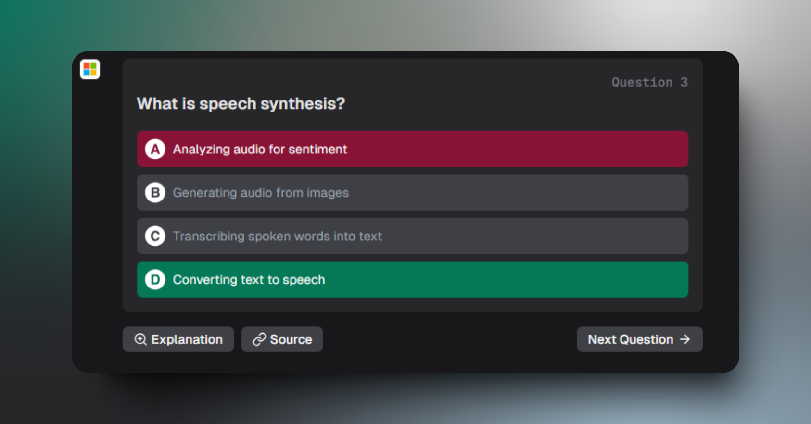

 <a href="https://microsoft-ai-900-quiz.vercel.app/">
  
  <h1 align="center">AI-900 Quiz</h1>
</a>

<p align="center">
Interactive chatbot designed to help users prepare for the Microsoft AI-900 certification exam. The project leverages Next.js and Vercel's AI SDK, featuring a quiz component with three difficulty levels, support for 16 languages, and powered by OpenAI's GPT-4o-mini language model.</p>

## Features

- Interactive chatbot interface
- Quiz with easy, intermediate, and hard questions
- Support for 16 languages
- Utilizes Vercel's AI SDK for UI streaming and LLM responses
- Over 600 custom questions based on Microsoft's documentation

## Technical Details

- Built on top Next.js AI Chatbot template to leverage the AI SDK for UI streaming and LLM responses
- Uses OpenAI's GPT-4o-mini language model
- Implements two system prompts with different tool calls for game management:

    During gameplay:
    - `presentNextQuestion`: Streams the main game component
    - `provideHint`: Offers a hint
    - `provideExplanation`: Explains the previous question. We use Groq API to get the explanation.
    - `showScore`: Displays the current score

    At game end (after 10 questions):
    - `resetQuiz`: Resets the game and returns to the Home screen

- Quiz state is managed using localStorage to save results

- More than 600 questions, created with ChatGPT 4o, the final quiz from the AI-900 learn.microsoft.com from every module, the AI-900 exam guide and samples from internet.

- Managing language with LLM streaming to the component.

## Difficulties Encountered

Initially, the project was conceived to have the LLM generate all questions and answers. This approach was abandoned due to the deterministic nature of LLMs, which resulted in limited question variety and incomplete coverage of the AI-900 syllabus. Instead, a custom GPT model was used to create a dataset of questions and correct answers based on Microsoft's documentation, with the LLM filling on the fly the rest in the streamUI.

Other LLMs were tested but often failed in "tool calling" functions. OpenAI proved to be the most reliable option for this feature. For explaining the questions, we use Groq API with Llama 3.1 70.

## Improvements

- Optimize the Quiz game component to function without AI, although the current implementation serves as a demo for this project, is not the most efficient way to create a reliable quiz game
- Cache responses to reduce costs, even though GPT-4o-mini is relatively inexpensive
- Integrate the two system prompts (game and end-of-game) into one, but this would be against the recommendation of not having more than 5 "tools" in a single interaction
- Better manage of memory for Chat history
- Implement authentication and database integration to save past conversations and quiz results
- Add a Retrieval Augmented Generation (RAG) system for the `provideExplanation` tool to ensure contextually accurate responses

## Future Ideas

- Develop an "ingest" system for notes or syllabi to create a vector database for RAG, questions, and answers, enabling the creation of personalized quizzes

## Getting Started

To get this project up and running on your local machine, follow these steps:

1. Clone the repository:
  
  ```bash
  git clone https://github.com/amalraju7/Microsoft-AI-900-Quiz.git
cd Microsoft-AI-900-Quiz
  ```

2. Install the dependencies:

  ```bash
npm install
  ```

3. Set up environment variables:
- Rename `.env.example` to `.env`
- Open the `.env` file and add your OpenAI & Groq API keys:
  ```
  OPENAI_API_KEY=your_api_key_here
  GROQ_API_KEY=your_api_key_here
  ```

4. Run the development server:
  
  ```bash
  npm run dev
  ```
5. Open [http://localhost:3000](http://localhost:3000) in your browser to see the application.

## Next.js AI Chatbot Template Authors Vercel

The chat template library is created by [Vercel](https://vercel.com) and [Next.js](https://nextjs.org) team members, with contributions from:

- Jared Palmer ([@jaredpalmer](https://twitter.com/jaredpalmer)) - [Vercel](https://vercel.com)
- Shu Ding ([@shuding\_](https://twitter.com/shuding_)) - [Vercel](https://vercel.com)
- shadcn ([@shadcn](https://twitter.com/shadcn)) - [Vercel](https://vercel.com)
